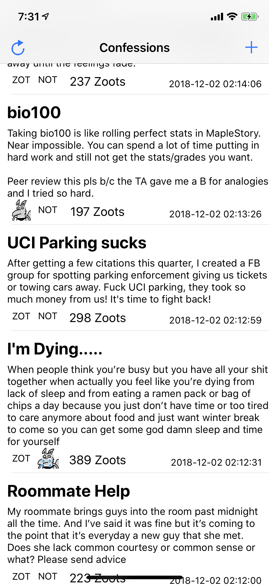

# UCI Confessions Mobile App

## Inspiration
A social media trend is surging through the campus of UCI known as "UCI Confessions". It is originally a private facebook group where users can anonymously share their deepest thoughts and secrets to the members of the group. We wanted to create a mobile application for "UCI Confessions", instead of it being a facebook page

## What it does
It allows users to anonymously submit text posts to the UCI Confessions database for all users of the app to see. Users can also upvote and downvote posts.

## How we built it
We created the application through swift. We mainly utilized the TableViewController to display data. We hosted a flask server on an Azure VM for quick and easy backend.

## Challenges we ran into
Originally we wanted to sync the posts on the facebook page with our app database, unfortunately the Facebook Developer API does not permit us to retrieve posts from Facebook groups, so we decided to create a brand new database for the confessions to be in

## Accomplishments that we're proud of
We are proud of our application, particularly the integration of Microsoft Azure and use of flask since none of us have used it before. 

## What we learned
Overall it was a great learning experience for us. We discovered things in swift we previously had not known and learnt totally new concepts such as flask as they were required for our project to work

## What's next for UCI Confessions
We hope for our application to be able to retrieve and post confessions in a synchronized manner with the Facebook page. To do this we have requested the Facebook API for further permissions to access and retrieve these data. In addition we hope to integrate a comment section for each confession.
